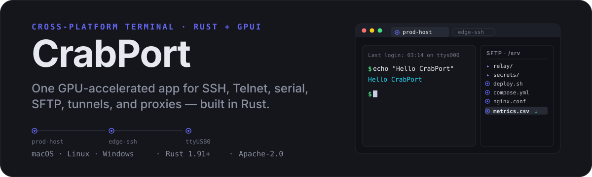
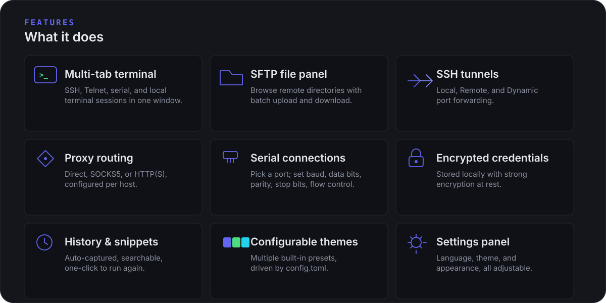
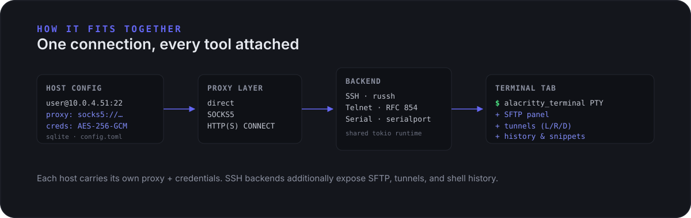
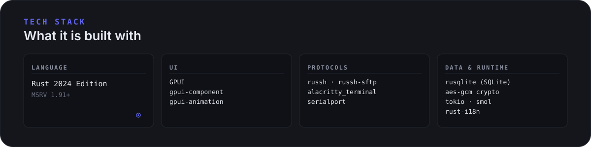
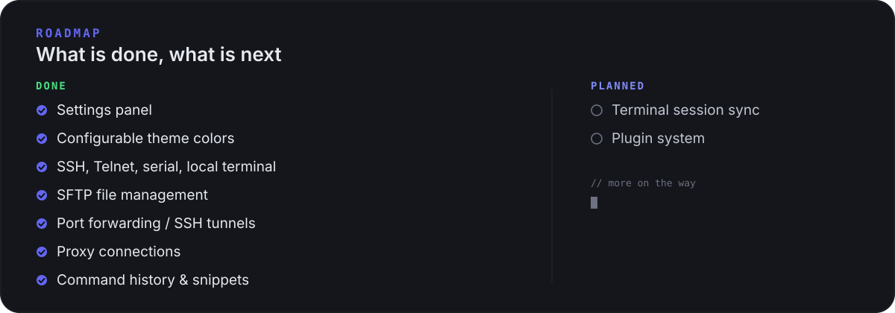

<p align="center">
  
</p>

<p align="center">
  <a href="https://github.com/chi11321/CrabPort/actions/workflows/dev.yml"></a>
  <a href="LICENSE"></a>
  
  
</p>

<p align="center">
  <a href="README.md">English</a> · <a href="README.zh-CN.md">简体中文</a>
</p>

---

CrabPort aims to be a cross-platform terminal that brings SSH, Telnet, serial, SFTP, tunnels, and proxy routing into one window — written in Rust and rendered with [GPUI](https://github.com/zed-industries/zed/tree/main/crates/gpui), the GPU-accelerated UI framework behind the Zed editor.

One host entry carries its own credentials, proxy, and serial settings; a terminal tab opens with SFTP, tunnels, and shell history attached when the backend supports them. Credentials are encrypted at rest with AES-256-GCM.

## Screenshots


## Features

<p align="center">
  
</p>

## How it fits together

<p align="center">
  
</p>

Each host entry stores its connection kind, credentials, proxy, and serial settings in a local SQLite database. The proxy layer wraps the transport (direct TCP, SOCKS5, or HTTP(S) CONNECT) before handing the stream to the SSH (russh), Telnet (RFC 854), or serial (`serialport`) backend. All backends share a single tokio runtime. SSH backends additionally expose SFTP, tunnels, and shell history to the tab.

## Download

Grab the latest build from the [Releases page](https://github.com/chi11321/CrabPort/releases):

| Platform | Download | Notes |
|----------|----------|-------|
| macOS (Apple Silicon) | `CrabPort-v*-macos-aarch64.dmg` | Open the `.dmg` and drag CrabPort to `/Applications` |
| macOS (Intel) | `CrabPort-v*-macos-x86_64.dmg` | Open the `.dmg` and drag CrabPort to `/Applications` |
| Linux (x64) | `CrabPort-v*-linux-x86_64.AppImage` | `chmod +x` and double-click; runtime libraries are bundled |
| Linux (arm64) | `CrabPort-v*-linux-aarch64.AppImage` | `chmod +x` and double-click; runtime libraries are bundled |
| Windows (x64) | `CrabPort-v*-windows-x86_64.zip` | Extract and run `CrabPort.exe` |
| Windows (arm64) | `CrabPort-v*-windows-aarch64.zip` | Extract and run `CrabPort.exe` |

> macOS builds ship as `.dmg`. Linux builds ship as `.AppImage` with the X11 / Wayland / Vulkan / fontconfig runtime bundled, so no manual system-package install is needed. Windows builds ship as a `.zip` because cargo-bundle v0.11.0 has an MSI packaging bug; no `.msi` installer is provided for now.

**macOS first-launch note**: you may see a "cannot verify developer" warning. Right-click the app → select **Open** to bypass, or run in Terminal:

```bash
xattr -cr /Applications/CrabPort.app
```

## Build from source

### Prerequisites

- **Rust 1.91+** (install via [rustup](https://rustup.rs/))
- Platform-native build toolchain

### Platform dependencies

**macOS** — Xcode Command Line Tools:

```bash
xcode-select --install
```

**Linux** (Debian/Ubuntu):

```bash
sudo apt-get install -y \
  libx11-dev libx11-xcb-dev libxcb1-dev libxcb-randr0-dev \
  libxcb-keysyms1-dev libxcb-icccm4-dev libxcb-image0-dev \
  libxcb-shape0-dev libxcb-xfixes0-dev libxcb-cursor-dev \
  libxkbcommon-dev libxkbcommon-x11-dev \
  libwayland-dev wayland-protocols \
  libgl1-mesa-dev libegl1-mesa-dev libvulkan-dev \
  libfontconfig1-dev libfreetype6-dev \
  libasound2-dev libpulse-dev libdbus-1-dev \
  libssl-dev pkg-config \
  squashfs-tools   # mksquashfs, required for .AppImage bundling
```

**Windows** — MSVC toolchain (ships with Visual Studio Build Tools).

### Build & run

```bash
git clone https://github.com/chi11321/CrabPort.git
cd CrabPort

cargo run                 # debug
cargo build --release     # release binary
```

### Bundle platform installers

Install [cargo-bundle](https://github.com/burtonageo/cargo-bundle) first:

```bash
cargo install cargo-bundle --locked
```

| Platform | Command | Output |
|----------|---------|--------|
| macOS | `cargo bundle --release --format dmg` | `target/release/bundle/dmg/CrabPort_*.dmg` |
| Linux | `cargo bundle --release --format appimage` | `target/release/bundle/appimage/CrabPort_*.AppImage` |
| Windows | `cargo build --release`, then zip the `.exe` manually | `CrabPort.exe` (`.zip`) |

> Windows does not use cargo-bundle: its v0.11.0 MSI bundler has a bug that writes a string into a binary column, so both CI and local builds ship a zipped `.exe` instead.

## Data storage

App data lives under the platform-standard directory:

| Platform | Path |
|----------|------|
| macOS | `~/Library/Application Support/crabport/` |
| Linux | `~/.local/share/crabport/` |
| Windows | `%APPDATA%\crabport\` |

Contents:

- `crabport.db` — SQLite database (hosts, credentials, snippets, tunnels, proxies)
- `.key` — AES-256 encryption key, randomly generated. Do not delete it; stored credentials cannot be decrypted without it.
- `config.toml` — app configuration (language, theme, appearance); written atomically.

## Tech stack

<p align="center">
  
</p>

## Roadmap

<p align="center">
  
</p>

## License

[Apache License 2.0](LICENSE) · Copyright © 2026 ch1ll321
