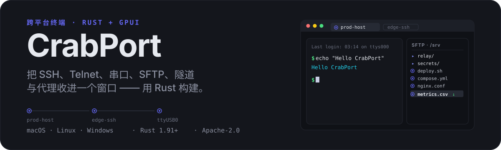
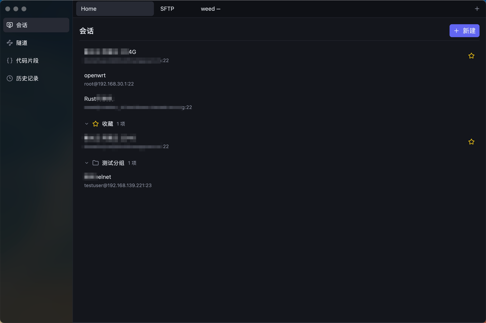
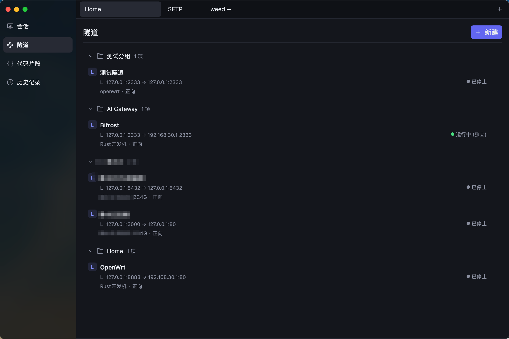
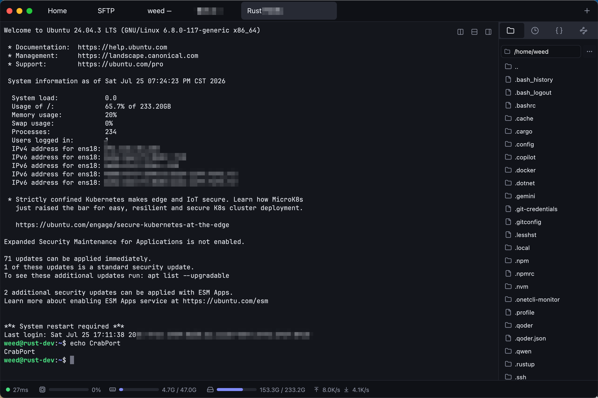
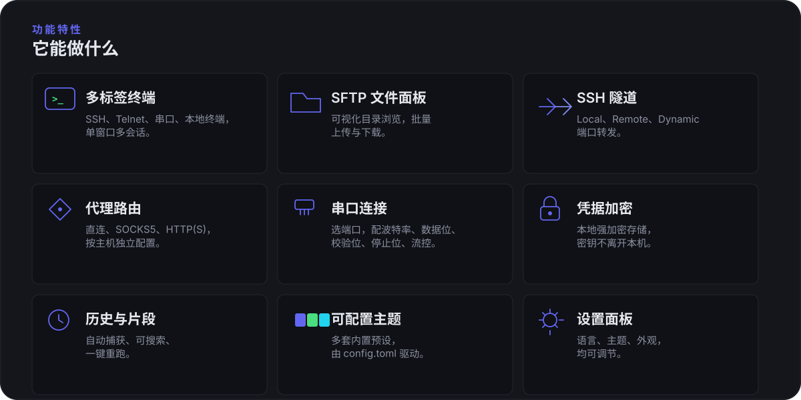
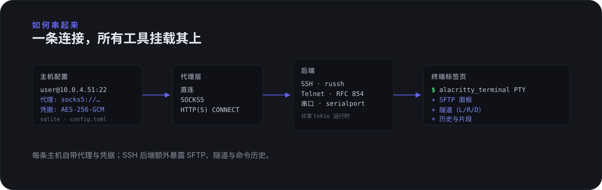
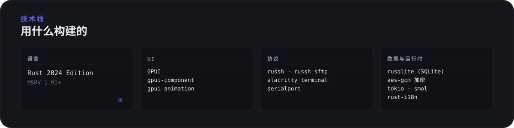
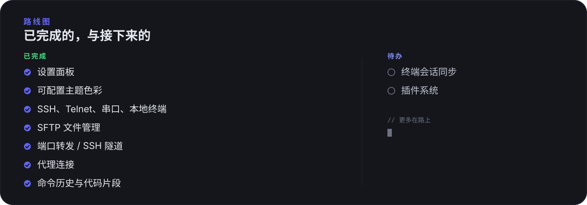

<p align="center">
  
</p>

<p align="center">
  <a href="https://github.com/chi11321/CrabPort/actions/workflows/dev.yml"></a>
  <a href="LICENSE"></a>
  
  
</p>

<p align="center">
  <a href="README.md">English</a> · <a href="README.zh-CN.md">简体中文</a>
</p>

---

CrabPort 旨在实现一个把 SSH、Telnet、串口、SFTP、隧道和代理路由收进同一窗口的跨平台终端 —— 使用 Rust 编写，基于 [GPUI](https://github.com/zed-industries/zed/tree/main/crates/gpui)（Zed 编辑器的 GPU 加速 UI 框架）渲染。

每条主机配置自带凭据、代理和串口参数；打开终端标签页时，如果后端支持，SFTP、隧道和命令历史会一并挂载。凭据使用 AES-256-GCM 在本地加密存储。

## 截图







## 功能特性

<p align="center">
  
</p>

## 架构概览

<p align="center">
  
</p>

每条主机记录把连接类型、凭据、代理和串口参数存入本地 SQLite 数据库。代理层包裹传输（直连 TCP、SOCKS5 或 HTTP(S) CONNECT），再把流交给 SSH（russh）、Telnet（RFC 854）或串口（`serialport`）后端。所有后端共享同一个 tokio 运行时；SSH 后端额外向标签页暴露 SFTP、隧道和命令历史。

## 下载安装

前往 [Releases 页面](https://github.com/chi11321/CrabPort/releases) 下载对应平台版本：

| 平台 | 下载文件 | 说明 |
|------|----------|------|
| macOS (Apple Silicon) | `CrabPort-v*-macos-aarch64.dmg` | 打开 `.dmg`，将 CrabPort 拖入 `/Applications` |
| macOS (Intel) | `CrabPort-v*-macos-x86_64.dmg` | 打开 `.dmg`，将 CrabPort 拖入 `/Applications` |
| Linux (x64) | `CrabPort-v*-linux-x86_64.AppImage` | 赋予执行权限后双击运行，内置运行时依赖 |
| Linux (arm64) | `CrabPort-v*-linux-aarch64.AppImage` | 赋予执行权限后双击运行，内置运行时依赖 |
| Windows (x64) | `CrabPort-v*-windows-x86_64.zip` | 解压后运行 `CrabPort.exe` |
| Windows (arm64) | `CrabPort-v*-windows-aarch64.zip` | 解压后运行 `CrabPort.exe` |

> macOS 版本以 `.dmg` 磁盘镜像分发。Linux 版本以 `.AppImage` 分发，内置 X11 / Wayland / Vulkan / fontconfig 等运行时库，无需手动安装系统依赖。Windows 版本以 `.zip` 分发，因 cargo-bundle v0.11.0 存在 MSI 打包 bug，暂不提供 `.msi` 安装包。

**macOS 首次启动提示**：可能会出现"无法验证开发者"警告。右键点击应用 → 选择"打开"即可绕过，或在终端执行：

```bash
xattr -cr /Applications/CrabPort.app
```

## 从源码构建

### 前置要求

- **Rust 1.91+**（推荐使用 [rustup](https://rustup.rs/) 安装）
- 平台原生构建工具链

### 各平台依赖

**macOS** —— Xcode Command Line Tools：

```bash
xcode-select --install
```

**Linux**（Debian/Ubuntu）：

```bash
sudo apt-get install -y \
  libx11-dev libx11-xcb-dev libxcb1-dev libxcb-randr0-dev \
  libxcb-keysyms1-dev libxcb-icccm4-dev libxcb-image0-dev \
  libxcb-shape0-dev libxcb-xfixes0-dev libxcb-cursor-dev \
  libxkbcommon-dev libxkbcommon-x11-dev \
  libwayland-dev wayland-protocols \
  libgl1-mesa-dev libegl1-mesa-dev libvulkan-dev \
  libfontconfig1-dev libfreetype6-dev \
  libasound2-dev libpulse-dev libdbus-1-dev \
  libssl-dev pkg-config \
  squashfs-tools   # 打包 .AppImage 所需的 mksquashfs
```

**Windows** —— MSVC 工具链（随 Visual Studio Build Tools 安装）。

### 编译运行

```bash
git clone https://github.com/chi11321/CrabPort.git
cd CrabPort

cargo run                 # Debug 模式
cargo build --release     # Release 编译
```

### 打包为各平台安装包

需先安装 [cargo-bundle](https://github.com/burtonageo/cargo-bundle)：

```bash
cargo install cargo-bundle --locked
```

| 平台 | 命令 | 产物 |
|------|------|------|
| macOS | `cargo bundle --release --format dmg` | `target/release/bundle/dmg/CrabPort_*.dmg` |
| Linux | `cargo bundle --release --format appimage` | `target/release/bundle/appimage/CrabPort_*.AppImage` |
| Windows | `cargo build --release`，然后手动压缩 `.exe` | `CrabPort.exe`（`.zip`） |

> Windows 暂不使用 cargo-bundle 打包：其 v0.11.0 的 MSI 打包器存在一个将字符串写入二进制列的 bug，因此 CI 与本地均直接压缩 `.exe` 分发。

## 数据存储位置

应用数据存储在系统标准目录下：

| 平台 | 路径 |
|------|------|
| macOS | `~/Library/Application Support/crabport/` |
| Linux | `~/.local/share/crabport/` |
| Windows | `%APPDATA%\crabport\` |

包含以下文件：

- `crabport.db` —— SQLite 数据库（主机、凭据、片段、隧道、代理）
- `.key` —— AES-256 加密密钥，随机生成。请勿删除，否则已存凭据无法解密。
- `config.toml` —— 应用配置（语言、主题、外观），原子写入。

## 技术栈

<p align="center">
  
</p>

## 路线图

<p align="center">
  
</p>

## 许可证

[Apache License 2.0](LICENSE) · Copyright © 2026 ch1ll321
